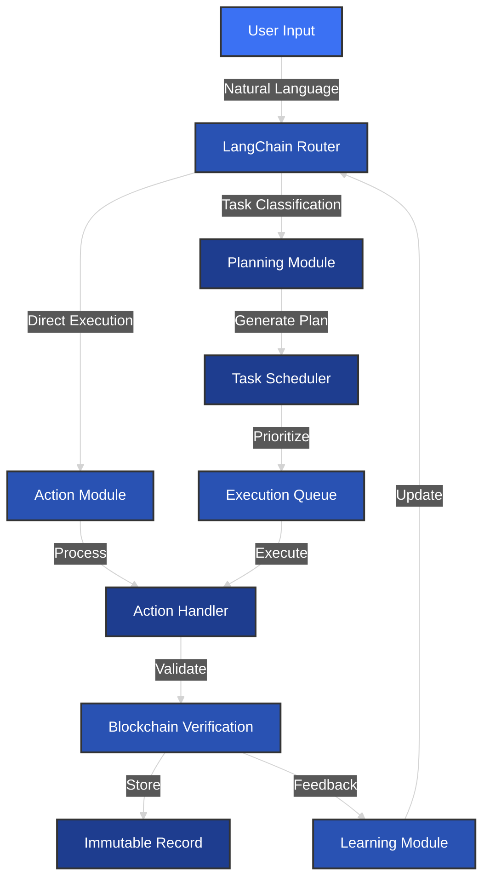
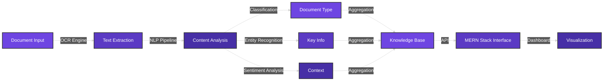
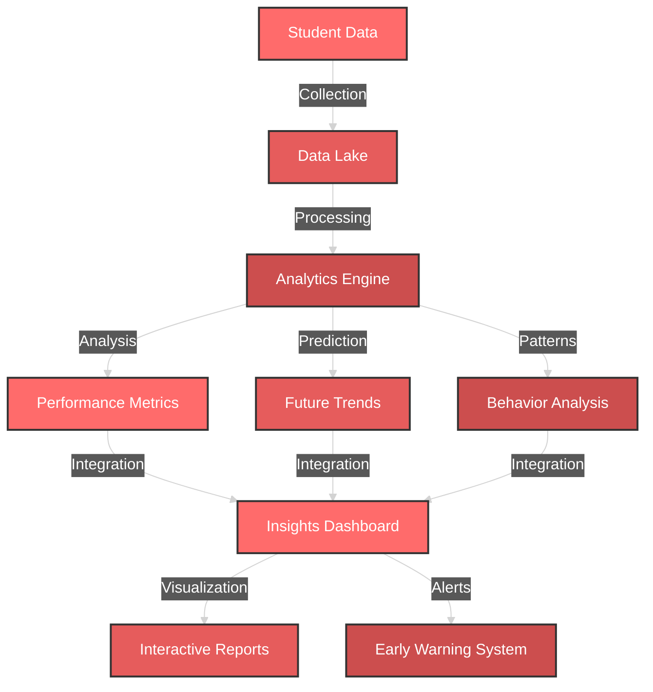

<!-- Matrix Code Rain Effect - Place this at the top for visual impact -->
<!-- Custom Matrix Style Header -->
<div align="center">
  
</div>
<!-- Matrix Animation with Name -->
<div align="center">
  <a href="https://git.io/typing-svg">
    
  </a>
</div>
<!-- Contribution Snake with Matrix Effect -->
<div align="center">
  <picture>
    <source media="(prefers-color-scheme: dark)" srcset="https://raw.githubusercontent.com/platane/snk/output/github-contribution-grid-snake-dark.svg">
    <source media="(prefers-color-scheme: light)" srcset="https://raw.githubusercontent.com/platane/snk/output/github-contribution-grid-snake.svg">
    
  </picture>
</div>
<!-- ASCII Art Name -->
<div align="center">
<pre>
<code>
██╗  ██╗██╗   ██╗███╗   ██╗██████╗  █████╗ ███╗   ██╗
██║ ██╔╝██║   ██║████╗  ██║██╔══██╗██╔══██╗████╗  ██║
█████╔╝ ██║   ██║██╔██╗ ██║██║  ██║███████║██╔██╗ ██║
██╔═██╗ ██║   ██║██║╚██╗██║██║  ██║██╔══██║██║╚██╗██║
██║  ██╗╚██████╔╝██║ ╚████║██████╔╝██║  ██║██║ ╚████║
╚═╝  ╚═╝ ╚═════╝ ╚═╝  ╚═══╝╚═════╝ ╚═╝  ╚═╝╚═╝  ╚═══╝
</code>
</pre>
</div>
<!-- Digital Circuit Line -->
<div align="center">
  
</div>
<div align="center">
  
  
  <h1>
     
    Kundan Sai Gopal N 
    
  </h1>

  <!-- Typing SVG with custom styling -->
  <a href="https://git.io/typing-svg">
    
  </a>
</div>

<!-- Animated Terminal Effect -->
```python
#!/usr/bin/python
# -*- coding: utf-8 -*-

class AIEngineer:
    def __init__(self):
        self.name = "Kundan Sai Gopal N"
        self.role = "AI Workflow Architect"
        self.language_spoken = ["en_US", "te_IN", "hi_IN"]
        self.current_work = {
            "company": "Blockchain Laboratories",
            "focus": "Agentic AI Systems",
            "tech": ["LangChain", "LangGraph", "LLMs"]
        }
        
    def daily_routine(self):
        return [
            "☕ Fuel up with coffee",
            "💻 Build intelligent systems",
            "🤖 Train AI models",
            "🔄 Optimize workflows",
            "📚 Learn new AI concepts"
        ]

me = AIEngineer()
print(f"🚀 Welcome to {me.name}'s AI Lab!")
```

<!-- Animated Skills Progress Bars -->
<details>
<summary>🎯 Skills Progress</summary>
<div align="center">

```text
AI/ML Development    ⣿⣿⣿⣿⣿⣿⣿⣿⣿⣀ 90%
LLM Systems          ⣿⣿⣿⣿⣿⣿⣿⣿⣀⣀ 80%
Cloud Computing      ⣿⣿⣿⣿⣿⣿⣿⣀⣀⣀ 70%
Blockchain           ⣿⣿⣿⣿⣿⣿⣀⣀⣀⣀ 60%
DevOps              ⣿⣿⣿⣿⣿⣿⣿⣀⣀⣀ 70%
```

</div>
</details>

## 🌟 Featured AI Projects

<details>
<summary>🤖 Agentic Workflow System</summary>



### Key Features
- 🎯 Autonomous task planning and execution
- 🔗 Blockchain-verified workflow states
- 📊 Real-time performance monitoring
- 🔄 Self-improving feedback loop

</details>

<details>
<summary>📊 Intelligent Document Processor</summary>



### Achievements
- 📈 92% accuracy in document classification
- ⚡ 85% reduction in processing time
- 🎯 Real-time data extraction and analysis

</details>

<details>
<summary>📚 Student Analytics Platform</summary>



### Impact
- 📊 75% reduction in administrative tasks
- 🎯 90% accuracy in performance prediction
- 📈 Improved student engagement by 60%

</details>

## 💻 Tech Mastery

<!-- Animated Tech Stack Icons -->
<div align="center">
  
  
  <!-- Custom AI Tool Icons -->
  <p>
    
    
    
  </p>
</div>

<!-- Animated Stats -->
<div align="center">
  
  
</div>

<!-- Activity Graph -->
<a href="https://github.com/ashutosh00710/github-readme-activity-graph">
  
</a>

## 🔮 Current AI Research

<details>
<summary>Research Areas</summary>

```python
research_interests = {
    "LLM Systems": [
        "Few-shot learning",
        "Prompt engineering",
        "Model distillation"
    ],
    "Multi-Agent Systems": [
        "Swarm intelligence",
        "Collaborative learning",
        "Emergent behaviors"
    ],
    "AI-Blockchain": [
        "Verifiable AI",
        "Decentralized learning",
        "Smart contracts"
    ]
}
```

</details>

<!-- Animated Connect Section -->
## 🤝 Let's Innovate Together

<div align="center">
  <a href="https://linkedin.com/in/kundan-sai-gopal-nanubala">
    
  </a>
  <a href="mailto:YOUR_EMAIL">
    
  </a>
  <a href="YOUR_PORTFOLIO">
    
  </a>
</div>

<!-- Animated Footer -->
<div align="center">
  
</div>

<!-- Profile Views Counter -->
<div align="center">
  
</div>
