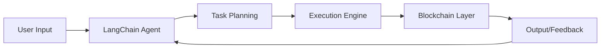

<div align="center">
  <h1>
     
    Hi there, I'm Kundan Sai Gopal N 
    
  </h1>
</div>

<div align="center">
  
</div>

<div align="center">
  <p>
    <a href="https://www.linkedin.com/in/kundan-sai-gopal-nanubala/"></a>
    <a href="mailto:YOUR_EMAIL"></a>
    
  </p>
</div>

## 🤖 AI Journey & Expertise

```python
class AIEngineer:
    def __init__(self):
        self.name = "Kundan Sai Gopal N"
        self.role = "AI Workflow Developer"
        self.language_spoken = ["en_US", "te_IN", "hi_IN"]
        self.current_work = "Building Agentic AI Systems"
    
    def say_hi(self):
        print("Thanks for dropping by! Let's collaborate on AI innovations!")

me = AIEngineer()
me.say_hi()
```

## 🎯 Current AI Focus
- 🧠 Developing intelligent agentic workflows using LangChain & LangGraph
- 🔄 Building autonomous AI systems with continuous learning capabilities
- 🌐 Integrating large language models with blockchain technology
- 📊 Implementing AI-driven analytics and process automation
- 🤝 Contributing to open-source AI projects

## 💻 Tech Arsenal

### AI/ML Stack
<p align="center">
  
  
  
  
  
</p>

### Development Stack
<p align="center">
  
</p>

### Tools & Platforms
<p align="center">
  
</p>

## 🌟 Featured AI Projects

### 🤖 Agentic Workflow System

- Built autonomous AI workflows using LangChain & LangGraph
- Implemented blockchain-based verification system
- Achieved 85% reduction in manual process time

### 🔄 Intelligent Document Processor
- Developed OCR system with advanced NLP capabilities
- Integrated with MERN stack for seamless data flow
- Processing accuracy improved by 92%

### 📊 Student Analytics Platform
- Created AI-driven educational insights system
- Implemented predictive analytics for student performance
- Reduced administrative workload by 75%

## 📈 AI Development Metrics

<div align="center">
  
  
</div>

## 🎓 Certifications & Learning
<p align="center">
  
  
  
</p>

## 🔮 AI Research Interests
- Large Language Models & Emergent Abilities
- Multi-Agent Systems & Swarm Intelligence
- AI Ethics & Responsible Development
- Blockchain-AI Integration
- Autonomous Systems Design

## 📚 Recent Blog Posts
<!-- BLOG-POST-LIST:START -->
- 🤖 [Building Scalable AI Workflows with LangChain](YOUR_BLOG_LINK)
- 🧠 [The Future of Multi-Agent Systems](YOUR_BLOG_LINK)
- 📊 [Integrating AI with Blockchain: A Practical Guide](YOUR_BLOG_LINK)
<!-- BLOG-POST-LIST:END -->

## 🎯 Future Goals
```javascript
const goals2024 = {
  technical: ['Advanced LLM Systems', 'AI-Blockchain Integration'],
  research: ['Publish AI Papers', 'Open Source Contributions'],
  community: ['AI Meetups', 'Technical Workshops'],
  personal: ['Continuous Learning', 'Innovation']
};
```

## 🤝 Let's Connect & Collaborate!

<div align="center">
  <a href="https://www.linkedin.com/in/kundan-sai-gopal-nanubala/">
    
  </a>
  <a href="mailto:YOUR_EMAIL">
    
  </a>
  <a href="YOUR_PORTFOLIO">
    
  </a>
</div>

---

<div align="center">
  
  <em>Innovation is intelligence having fun!</em>
  
</div>

<div align="center">
  
</div>
